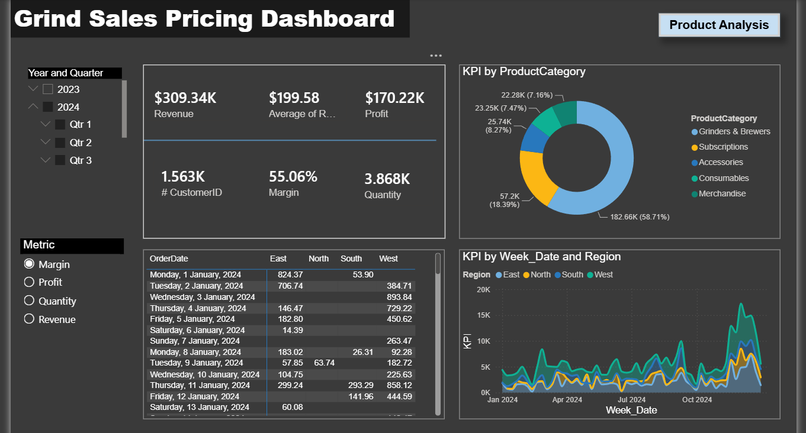

# The Daily Grind: Sales Pricing & Profit Margin Optimization

## 📌 Project Overview
This project delivers a data-driven **Sales Pricing & Profit Margin Dashboard** for **The Daily Grind**, a specialty coffee and merchandise brand. In response to a significant portfolio-wide decrease in profit margins caused by rising Cost of Goods Sold (COGS) and tariffs between 2023 and 2025, this end-to-end analysis identifies high-risk, low-margin products and provides concrete, data-backed pricing restructuring recommendations to executive leadership.

---

## 🛠️ Tech Stack & Tools
* **Database Management & ETL:** SQL (Multi-table joins, data cleaning, and unified dataset preparation)
* **Data Visualization:** Power BI
* **Analytical Calculations:** DAX (Gross Margin %, Year-over-Year (YoY) GMP trends, and Time-Intelligence filtering)

---

## 💡 Business Case Analysis (STAR Framework)

### 1. Situation (The Context)
**The Daily Grind** experienced a critical squeeze on its net profit margins across 2023–2025 order cycles. The Director of Operations identified external cost pressures—specifically rising supplier COGS and import tariffs—as the primary threats to the business's financial sustainability. Leadership required immediate visibility into product-level and regional profitability to re-engineer their global pricing strategy.

### 2. Task (The Goal)
My core objectives for this analysis were to:
1. **Extract and unify** historical order data from multiple relational database tables using SQL.
2. **Identify all products** where the Gross Margin % (GMP) fell below management's **30% safety threshold** during Q3 2025.
3. **Develop an interactive dashboard** showcasing YoY GMP trends, revenue by product categories, and regional performance.
4. **Formulate strategic recommendations** on which specific stock-keeping units (SKUs) require immediate price hikes or absolute discontinuation.

### 3. Action (Our Approach)
* **Data Extraction & Consolidation (SQL):** Wrote advanced SQL queries utilizing `INNER JOIN` operations to pull data scattered across multiple backend tables (Orders, Products, and Regional logs). Unified the data into a single, clean flat-table optimized for Power BI import.
* **Profitability Calculations (DAX):** Formulated robust DAX measures to track profitability metrics dynamically, including:
  $$\text{Gross Margin \% (GMP)} = \frac{\text{Total Revenue} - \text{Total COGS}}{\text{Total Revenue}}$$
* **Time-Series Filtering:** Built targeted filtering parameters to isolate performance specifically for the critical Q3 2025 window.
* **UI/UX Design:** Engineered an intuitive layout highlighting Year-over-Year GMP trends, Revenue by Category, and a detailed Product/Region Matrix View for fast decision-making.

---

## 📊 Executive Dashboard Breakdown
The **Grind Sales Pricing Dashboard** satisfies all core management requirements in a centralized screen:

1. **YoY Gross Margin % Trend:** Line charts displaying the historical contraction of profit margins from 2023 to 2025, proving the impact of rising COGS.
2. **Revenue & Profitability by Category:** Bar chart breakdowns separating coffee equipment, accessories, and merchandise to show where cash flow is healthiest.
3. **Product & Regional Matrix View:** A detailed tabular visual cross-referencing Revenue and GMP across different geographical sales territories.

---

## 🚀 Data-Backed Strategic Pricing Recommendations

Based on the Gross Margin Percentage analysis isolated during the **Q3 2025** review window, immediate operational changes are required:

### ⚠️ 1. Immediate Discontinuation or Severe Price-Hike
The following accessories and merchandise items have dropped severely below the 30% margin threshold due to macro cost increases and are structurally weak contributors:
* **Chemex Filters (100 pack):** Currently yielding the lowest total margin in the entire portfolio at **14.58%**. 
* **Minimalist Keychain:** Yielding an unsustainable **15.59%** margin.
* **Logo Hoodie (Black):** Yielding a low **16.34%** margin.
* *Action Required:* Management must either immediately raise retail prices for these items by **25% or more** to absorb the COGS inflation, or discontinue them entirely to protect the portfolio's average margin.

### 🔄 2. Required Price Adjustment
* **Gooseneck Electric Kettle:** This high-revenue product has experienced margin dilution, dropping beneath the 30% target.
* *Action Required:* Implement a calculated price increase to safely restore its Gross Margin Percentage (GMP) back above the **30% threshold** without destroying consumer demand.

---

## 📸 Dashboard Preview & Interaction
> 💡 *Below is the visual overview of the Grind Sales Pricing Dashboard.*

